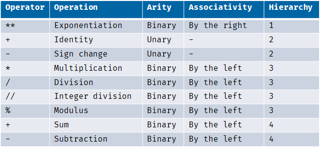
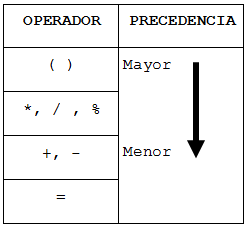
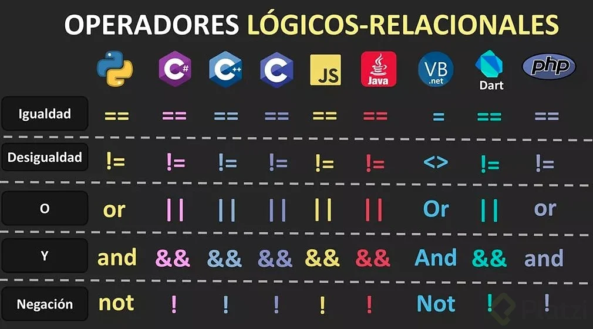

# Capacitación Universidad Agustiniana

# *Python 3*

> 23 Septiembre 2023

[Colab](https://colab.research.google.com/?hl=es)

Variable -> Espacio en memoria temporal RAM.

> Tipos de Datos
> - Booleanos
> - Texto
> - Numeros Enteros
> - Numeros Complejos
> - Numeros Reales
>
> Estructuras de Datos
> - Arrays
> - Dictionary
> - Set
> - Tuplas

### Tipado Dinamico y Tipado Fuerte

Los cambios se ven reflejados en la escritura de codigo al definir el tipo de la variable:

Ejemplo Fuerte :

``int numero = 10``

Ejemplo Debil :

``numero = 10`` el lenguaje de programacion identifica el tipo de dato

### Operadores Aritmeticos

> Suma -> +
>
> Resta -> -
>
> Multiplicacion -> *
>
> Division Entera -> //
>
> Division -> /
>
> Potencia -> **
>
> Modulo -> %

### Procedencia  Aritmetica!

### Operadores Logicos

> Operadores Logicos Relacionales
> - Igualdad -> ==
> - Desigualdad -> !=
> - O -> ora
> - Y -> and
> - Negacion -> Not

### Funcion para identificar el tipo de dato

``print(type(variable))``

### Comparacion de valores por Caracteres (string):

> Los caracteres también son números, para esto existen estándares que asignan un número a cada carácter, para generar
> un estándar se creó el ASCII pero esta solo toma en cuenta los caracteres en inglés, para dar soporte a más lenguajes
> se
> crea UNICODE.
[Referencia](https://platzi.com/clases/1104-python-2019/7093-comparacion-de-strings-y-unico-1/)

